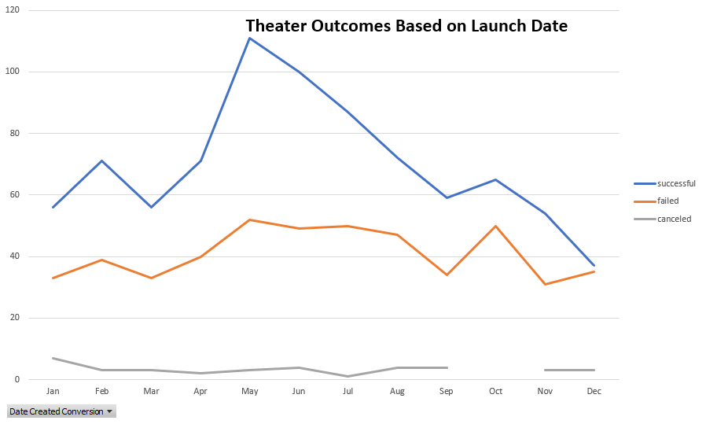

# Kickstarting with Excel

## Overview of Project
### Performing data analysis using MS Excel on over 4 thousand crowdfunding projects to find trends.

## Purpose
### To assist Louise with her project campaign and answer the questions how different campaigns fared in relation to their launch dates and funding goals.

## Analysis and Challenges

### Analysis of Theater outcomes based on launch date:
####I used the Kickstart data in order to analyze crowdfunding campaigns and view correlation of outcomes by launch date.
####The data is filtered by Theater (parent category) and Year. The data is also analyzed to view the theater outcomes by creating pivot table to count different outcomes by categories; sucessful, failed or canceled.
*graph below

*Please view excel workbook Kickstarter_Challenge and tab Theater Outcomes by Launch Date.

### Analysis of Outcomes Based on Goals
####Again I used the Kickstart data to analysis outcomes of Plays based by Goal amounts. What did the data tells for plays outcomes and goal amounts for each play.
*Goal amounts were grouped into dollar ranges in order to view the outcomes of plays.
*The number of successful, failed, canceled campaigns with total number of projects, and calculated the percentage of successful, failed, canceled plays.

### Challenges and Difficulties Encountered
*One of the challenges I found was converting the timestamp to a standard date then to obtain the year. The equation I have never worked with. 
*Another difficulty was the Outcomes based on goals using the excel formual Countifs. What a great formula seemed pretty straight forward but strugulled with getting correct results.  The issue was <= and/or >= I had to add additional statements to obtain correct values. 

## Results

- What are two conclusions you can draw about the Outcomes based on Launch Date?
*Two conclusions can be drawn from the Outcomes based on Launch date, one is that Theater category is the most successful compared to other categories. Second the most successful months for theater campagigns is between May and June. 

- What can you conclude about the Outcomes based on Goals?
*That the highest number of 1. successful and 2. failed plays were at goal amounts between $1,000 to 4,999.

- What are some limitations of this dataset? 
*The data was limited from 2010 to 2017 - why wasn't 2018, 2019 and 2020 included. Dataset did not include expenses for campaigns. 

- What are some other possible tables and/or graphs that we could create?  
* A  table of number of backers and success, failure and cancelled parent categories. 
